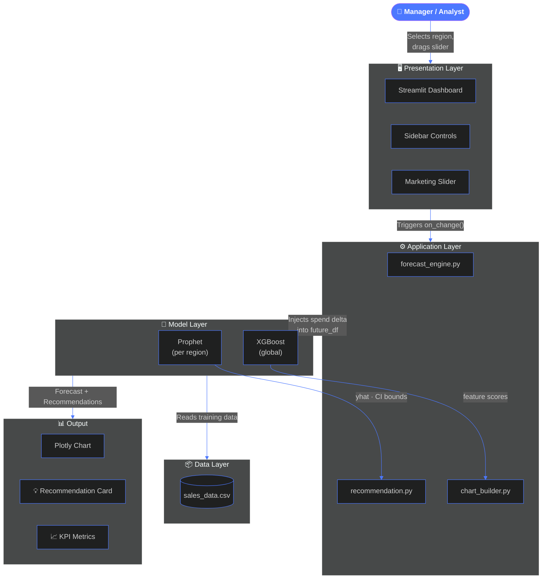

<div align="center">

<!-- ═══════════════════════════════════════════════════════════════ -->
<!--                     ANIMATED HERO HEADER                       -->
<!-- ═══════════════════════════════════════════════════════════════ -->


<!-- ANIMATED DATA GIF — full width, immersive -->


</div>

<br/>

<div align="center">

<!-- TYPEWRITER — loops through key features -->


<br/><br/>

<!-- TECH BADGES -->

&nbsp;

&nbsp;

&nbsp;

&nbsp;


<br/><br/>

<!-- SKILL ICONS -->


<br/><br/>

<!-- NAVIGATION PILLS -->
<a href="#-overview"></a>
&nbsp;
<a href="#%EF%B8%8F-live-dashboard"></a>
&nbsp;
<a href="#-core-features"></a>
&nbsp;
<a href="#-getting-started"></a>

</div>

---

<br/>

## 🧭 Overview


Every Monday morning, managers face the same painful reality:

> *"Sales are down. Is this a trend or a blip?*
> *Should I increase marketing? By how much?*
> *Which region needs attention first?"*

**This tool answers all three — in seconds.**

The **AI Decision Support System** combines statistical forecasting (**Prophet**) with machine learning interpretability (**XGBoost**) inside a live Streamlit dashboard. Managers — not just data scientists — can see:

- 📈 **What is happening** — 30-day forecast
- 🔍 **Why it's happening** — feature importance
- 🎚️ **What to do next** — plain-English recommendations

<br clear="right"/>

<br/>

<div align="center">

| 👤 Role | 🎯 Use Case |
|:---|:---|
| 📍 Regional Sales Manager | Forecast next month's revenue by region |
| 📣 Marketing Director | Simulate ROI of increased spend before committing |
| 🏢 Operations Lead | Identify seasonal dips early and plan capacity |
| 📊 Business Analyst | Validate intuition with data-driven evidence |
| 🎓 Data Science Student | Real-world ML pipeline to study and extend |

</div>

---

<br/>

## 🖥️ Live Dashboard

<div align="center">


&nbsp;&nbsp;

&nbsp;&nbsp;


<br/><br/>


</div>

---

<br/>

## ✨ Core Features

<div align="center">

&nbsp;&nbsp;

&nbsp;&nbsp;

</div>

<br/>

<table>
<tr>
<td width="50%" valign="top">

### 📊 30-Day Sales Forecast


<br/>

Prophet generates a forward forecast with a **95% confidence interval** — managers see the best estimate and the uncertainty band together.

```python
model = Prophet(
    seasonality_mode        = 'multiplicative',
    yearly_seasonality      = True,
    weekly_seasonality      = True,
    changepoint_prior_scale = 0.05,
    interval_width          = 0.95
)
model.add_regressor('marketing_spend')
forecast = model.predict(future_df)
```

| Column | Meaning |
|--------|---------|
| `yhat` | Best point estimate |
| `yhat_lower` | Lower 95% bound |
| `yhat_upper` | Upper 95% bound |
| `trend` | Direction without noise |

</td>
<td width="50%" valign="top">

### 🔍 XGBoost Feature Importance


<br/>

Tells managers exactly **which factors drive sales** — so budget decisions are based on data, not gut feeling.

| Feature | Score | Meaning |
|---------|:-----:|---------|
| 💰 Marketing Spend | **0.42** | Biggest controllable lever |
| 📅 Month of Year | 0.28 | Strong seasonal patterns |
| 🗺️ Region | 0.16 | Geography drives differences |
| 🎉 Holiday Flag | 0.09 | Events have measurable impact |
| 📆 Day of Week | 0.05 | Minor weekly variation |

> **Result:** Marketing Spend + Month alone explain **70%** of revenue variance.

</td>
</tr>
<tr>
<td width="50%" valign="top">

### 🎚️ What-If Marketing Simulator


<br/>

Drag the slider. Watch the forecast update. No reload. No waiting. **Under 100ms.**

```
  Base spend:    $10,000
  Adjusted:      $12,000  (+20%)
  ─────────────────────────────
  Forecast Δ:    +$4,200/month
  ROI:           ×3.5
  Confidence:    HIGH  ●●●○
```

</td>
<td width="50%" valign="top">

### 💡 Smart Recommendations


<br/>

Every session closes with a plain-English action. No jargon. Just the next move.

> *"North region trending up +8.3%. Current momentum strong. Maintain +20% marketing spend to sustain the trajectory."*

Powered by a **rule-based recommendation engine** trained on forecast trend deltas, confidence thresholds, and region-level seasonality signals.

</td>
</tr>
</table>

---

<br/>

## 🏗️ System Architecture

<div align="center">

&nbsp;&nbsp;

&nbsp;&nbsp;

</div>

<br/>



<br/>

```
┌─────────────────────────────────────────────────────────────┐
│  Layer              │  Components                           │
├─────────────────────┼───────────────────────────────────────┤
│  🖥️  Presentation   │  Streamlit · Sidebar · Sliders        │
│  ⚙️  Application    │  forecast_engine · recommendation     │
│  🧠  Model          │  Prophet (per region) · XGBoost        │
│  📦  Data           │  sales_data.csv                       │
└─────────────────────────────────────────────────────────────┘
```

---

<br/>

## ⚡ Data Flow — What-If Pipeline

<div align="center">


</div>

<br/>

```
  ╔══════════════════════════════════════════════════════════╗
  ║              WHAT-IF SIMULATION PIPELINE                  ║
  ╠══════════════════════════════════════════════════════════╣
  ║                                                          ║
  ║   🖱️  User drags slider                                  ║
  ║          │                                               ║
  ║          ▼                                               ║
  ║   ┌─────────────────┐                                   ║
  ║   │  st.slider()    │  new_spend = base × 1.20          ║
  ║   │  on_change()    │  fires immediately ⚡              ║
  ║   └────────┬────────┘                                   ║
  ║            │                                             ║
  ║            ▼                                             ║
  ║   ┌─────────────────┐                                   ║
  ║   │ forecast_engine │  future_df["spend"] = new_spend   ║
  ║   │      .py        │  inject delta into future frame   ║
  ║   └────────┬────────┘                                   ║
  ║            │                                             ║
  ║            ▼                                             ║
  ║   ┌─────────────────┐                                   ║
  ║   │ model.predict() │  returns yhat · lower · upper     ║
  ║   │  Prophet model  │  loaded from prophet_North.json   ║
  ║   └────────┬────────┘                                   ║
  ║            │                                             ║
  ║            ▼                                             ║
  ║   ┌─────────────────┐                                   ║
  ║   │recommendation   │  trend Δ → plain-English action   ║
  ║   │      .py        │  "North trending up +8.3% ..."    ║
  ║   └────────┬────────┘                                   ║
  ║            │                                             ║
  ║            ▼                                             ║
  ║   ┌─────────────────┐                                   ║
  ║   │st.plotly_chart()│  chart redraws in browser         ║
  ║   │   browser UI    │  ⚡ total round-trip: < 100ms     ║
  ║   └─────────────────┘                                   ║
  ║                                                          ║
  ╚══════════════════════════════════════════════════════════╝
```

---

<br/>

## 🛠️ Technology Stack

<div align="center">


<br/><br/>

| Tool | Version | Role |
|:-----|:-------:|:-----|
|  **Python** | 3.8+ | Core language |
|  **Streamlit** | latest | Dashboard UI & real-time widgets |
|  **Prophet** | v1.1.5 | Time-series forecasting |
|  **XGBoost** | v1.7.6 | Feature importance & gradient boosting |
|  **Plotly** | latest | Interactive charts — zoom, hover, export |
|  **Pandas** | latest | Data manipulation |
|  **NumPy** | latest | Numerical computing |
|  **scikit-learn** | latest | Evaluation utilities |
| **Joblib** | latest | Model serialisation & persistence |

</div>

---

<br/>

## 🚀 Getting Started

<div align="center">


</div>

<br/>

**① Clone the repository**
```bash
git clone https://github.com/LuthandoCandlovu/ai-decision-support.git
cd ai-decision-support
```

**② Create virtual environment**
```bash
python -m venv venv
source venv/bin/activate        # macOS / Linux
venv\Scripts\activate           # Windows
```

**③ Install dependencies**
```bash
pip install -r requirements.txt
```

**④ Generate synthetic data**
```bash
python generate_data.py
```

**⑤ Train models**
```bash
python train_model.py       # Prophet — one per region  (~85s)
python train_xgboost.py     # XGBoost — global model    (~12s)
```

**⑥ Launch dashboard 🔥**
```bash
streamlit run dashboard/app.py
# 🌐 Opens at http://localhost:8501
```

<details>
<summary><b>📦 Full dependency list</b></summary>

```
streamlit      Dashboard framework
prophet        Time-series forecasting
xgboost        Feature importance & ML
pandas         Data manipulation
numpy          Numerics
plotly         Interactive charts
scikit-learn   Evaluation utilities
joblib         Model persistence
shap           Explainability (planned)
```
</details>

---

<br/>

## 📖 Usage Workflow

<div align="center">

```
  ┌─────────────────────────────────────────────────────────────┐
  │                   HOW TO USE THE DASHBOARD                   │
  ├────┬──────────────────────────────┬───────────────────────── ┤
  │ 1  │ Select a region (sidebar)    │ Charts switch instantly  │
  │ 2  │ Read the historical trend    │ Blue line = past actuals │
  │ 3  │ Study the forecast ribbon    │ Orange = prediction + CI │
  │ 4  │ Check feature importance     │ See what drives numbers  │
  │ 5  │ Drag marketing spend slider  │ Forecast updates live ⚡ │
  │ 6  │ Read the recommendation      │ Plain-English next move  │
  └────┴──────────────────────────────┴─────────────────────────┘
```

</div>

---

<br/>

## 📁 Project Structure

```
ai-decision-support/
│
├── 📂 dashboard/
│   ├── app.py                  ← 🚀 Streamlit entry point
│   ├── forecast_engine.py      ← 🔮 Prophet inference + spend delta
│   ├── recommendation.py       ← 💡 Plain-English action generator
│   └── chart_builder.py        ← 📊 Plotly chart factory
│
├── 📂 models/
│   ├── prophet_North.json      ← 🌍 Region-specific models
│   ├── prophet_South.json
│   ├── prophet_East.json
│   ├── prophet_West.json
│   ├── prophet_Central.json
│   └── xgboost_global.joblib   ← 🤖 Global XGBoost model
│
├── 📂 data/
│   └── sales_data.csv          ← 📦 Training & prediction input
│
├── 📂 notebooks/
│   ├── 01_explore_data.ipynb
│   ├── 02_prophet_analysis.ipynb
│   └── 03_xgboost_shap.ipynb
│
├── 🐍 generate_data.py
├── 🐍 train_model.py
├── 🐍 train_xgboost.py
├── 📄 requirements.txt
└── 📄 README.md
```

---

<br/>

## 📊 Performance

<div align="center">

**Accuracy** — 20% held-out test set:

| Model | MAE | RMSE | Score |
|:------|----:|-----:|------:|
| Prophet | $812 | $1,043 | MAPE **5.8%** |
| XGBoost | $724 | $988 | R² **0.91** |

<br/>

**Runtime** — MacBook Pro M1, 8 GB RAM:

| Task | Time |
|:-----|-----:|
| Prophet training (5 regions) | ~85 sec |
| XGBoost training | ~12 sec |
| Dashboard cold start | ~4 sec |
| Forecast per query | < 200ms |
| Slider What-If update | **< 100ms** ⚡ |

</div>

---

<br/>

## 🗺️ Roadmap

<div align="center">

</div>

<br/>

```
 Phase 1 — Core System               ████████████████████  100% ✅
   ✔ Prophet forecasting per region
   ✔ XGBoost feature importance
   ✔ Streamlit interactive dashboard
   ✔ Real-time What-If slider
   ✔ Smart recommendations engine

 Phase 2 — Explainability            ██████████░░░░░░░░░░   50% 🔄
   ◉ SHAP waterfall explainability plots
   ◉ Multi-product support
   ◉ Anomaly detection alerts

 Phase 3 — Enterprise                ░░░░░░░░░░░░░░░░░░░░    0% 📅
   ○ PDF export of forecasts
   ○ PostgreSQL / BigQuery connector
   ○ Streamlit Cloud deployment
   ○ Multi-tenant user authentication
   ○ Automated weekly retraining
```

---

<br/>

## 🤝 Contributing

<div align="center">


</div>

<br/>

```bash
git checkout -b feature/your-feature-name
git commit -m "feat: describe your change clearly"
git push origin feature/your-feature-name
# → Open a Pull Request on GitHub 🙌
```

> Ideas welcome: SHAP plots · new region data · unit tests · new chart types · translations

---

<br/>

<div align="center">

## 📜 License & Contact

**MIT License — free to use, modify, and distribute.**

<br/>

[](https://github.com/LuthandoCandlovu)
&nbsp;
[](https://linkedin.com/in/luthando-candlovu)
&nbsp;
[](https://github.com/LuthandoCandlovu/ai-decision-support)

<br/>


<br/>


<br/><br/>

<a href="https://github.com/LuthandoCandlovu/ai-decision-support">
  
</a>

<br/><br/>


</div>
